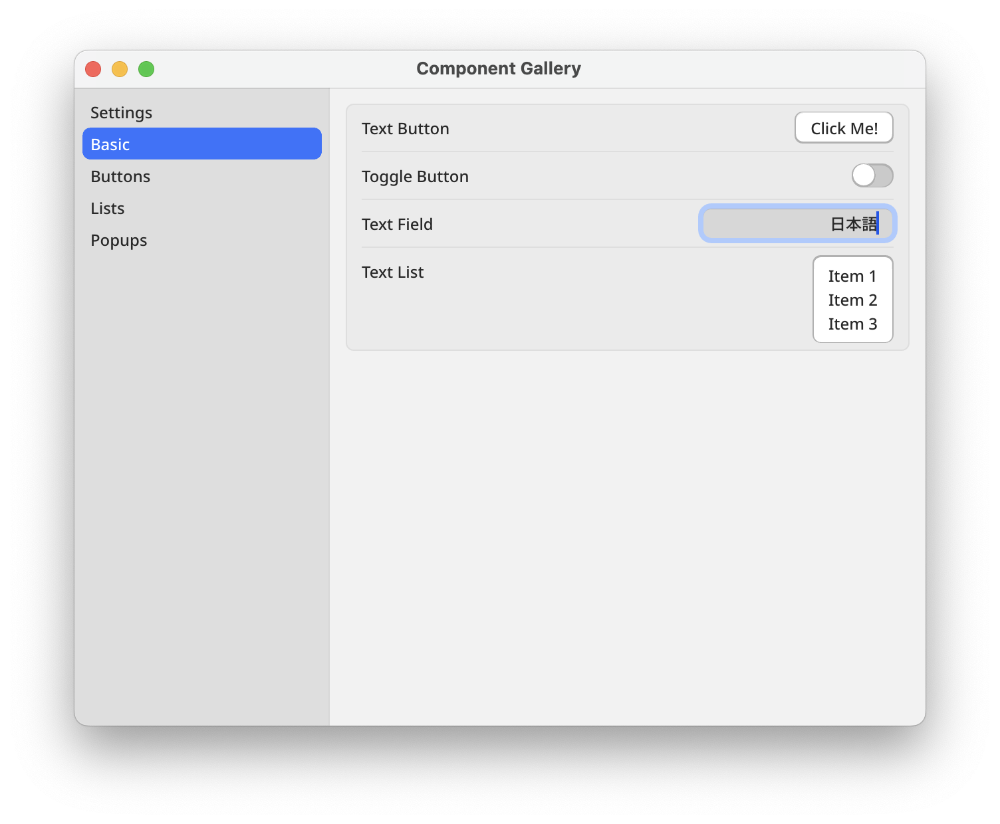
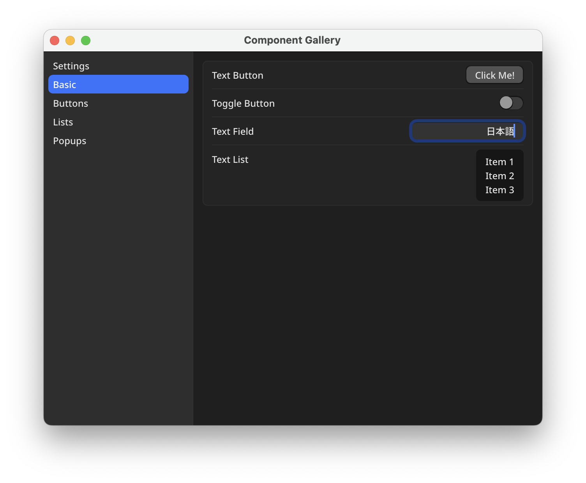

# Guigui (ぐいぐい)

An experimental GUI framework for Go with Ebitengine.

**This project is an alpha version, and everything may change in the future.**

**Except for minor changes like typo fixes, we have not yet established a development policy for accepting changes. For new widgets, please make your proposal in [Discussion](https://github.com/hajimehoshi/guigui/discussions/13).**

 * Supports Hi-DPI for clear visuals on modern displays.
 * Built-in internationalization (I18N) support for multiple languages.
 * Efficient rendering with optimized draw calls for better performance.

| Light Mode | Dark Mode |
| --- | --- |
|  |  |

```sh
git clone https://github.com/hajimehoshi/guigui.git
cd guigui
go run ./example/gallery
```
